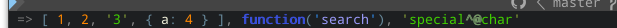
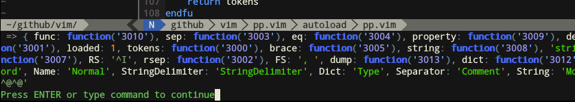
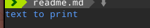

# *pp.vim* - pretty printer
===========================

> A better echo

`command! Pp [args...]`

Where **args** is a comma-separated list of vim expressions that will be eveluated.
You can also use it as a replacement for `call` command, it will show a pretty
return value.

```viml
" An example:
Pp [1, 2, '3', {'a': 4}], function('search'), "special\nchar"
```


**pp.vim** defines the global dict `pp`, which contains the functions for printing/parsing.

```viml
Pp pp
```



## Settings

### theme:

You can define your theme by:
 * defining a global func `PPtheme`
 * calling `pp#theme(dict)`
 * setting `g:pp['theme']`

```viml
" pp.theme =>

let theme = {}
let theme['Name']            = 'Normal'
let theme['String']          = 'String'
let theme['Number']          = 'Number'
let theme['Float']           = 'Number'
let theme['Function']        = 'Function'
let theme['FuncIdentifier']  = 'Identifier'
let theme['List']            = 'Enum'
let theme['Dict']            = 'Structure'
let theme['SpecialChar']     = 'SpecialChar'
let theme['Separator']       = 'Comment'
let theme['Delimiter']       = 'Delimiter'
let theme['StringDelimiter'] = 'StringDelimiter'
```

You can also get the pretty theme by calling `pp#prettyTheme()`.

### Functionnal

- `pp#()` : returns `pp` dict

- `pp#print(...)`: the function called by `Pp` command

- `pp#dump(obj[, depth=2])`: prints `obj` 

- `pp#theme()`: returns current theme

- `pp#theme(t)`: sets `pp['theme']` to `t`

Calling `pp` object functions:
```viml
let obj   = {'some': {'object': {'very': {'deeply': 'recursive'}}}}
let depth = 4
call pp.dump(obj, depth)
" (Pp command default is depth=2)
```

```viml
" Don't tell anyone, but if ever you need to print a message 
" with highlight:
call pp._('Keyword', 'text to print')
```


